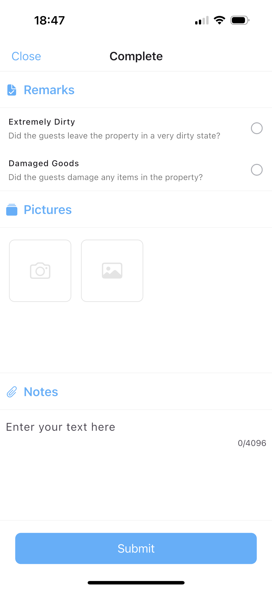

# Completing a task

After completing a cleaning assignment in the Guestway App, it is crucial to properly finalize the task by ensuring all required information is accurately logged. This step helps maintain high quality standards and guarantees that every detail has been addressed before marking the job as complete.

### Step-by-Step: How to Complete a Cleaning Task

Once you've cleaned the property, follow these steps in the **“Complete”** section of the app:

<figure><figcaption></figcaption></figure>

#### Remarks

During the task completion process, you will be prompted to answer two important questions:

* **Extremely Dirty:** Was the property left in an exceptionally dirty condition by the guests?
* **Damaged Goods:** Did the guests cause any damage to the property or its contents?

Please make sure to check the relevant boxes honestly and accurately. This information is crucial for the management team to assess the situation and take appropriate action, which may include pursuing guest compensation or scheduling additional cleaning or repairs. Providing clear and truthful remarks helps maintain property standards and supports effective resolution of any issues.

#### Pictures

Be sure to upload clear photos of the cleaned kitchen, bedroom, and bathroom after completing the task. If you encounter any damage or extreme mess left by guests, take additional photos to document these issues as proof.

These photos are essential not only for record-keeping but also to visually document the quality of your work. They also serve as important evidence to support any claims related to damages or excessive cleaning needs, helping the management team handle disputes or compensation requests effectively.

#### Notes

In the notes section, please provide any relevant details that may affect the property or cleaning process. This can include:

* Broken or missing items discovered during cleaning
* Low inventory levels or consumables that need to be restocked
* Any unusual issues encountered or specific feedback about the property

Use clear, concise, and specific language to ensure the management team can quickly understand and act upon your report. Detailed notes help maintain property standards, improve communication, and streamline any necessary follow-up actions.

**Submit**

Once all the fields are completed, tap the **"Submit"** button to officially complete the task.

#### Error Message Reminder

If you attempt to submit a cleaning task without completing all required fields, the app will display an error message. This feature is designed to ensure that:

* No important details are overlooked
* Every step of the cleaning process is fully completed
* All necessary information is properly recorded before the task can be marked as complete

This safeguard helps maintain high standards and guarantees that tasks are finished thoroughly, preventing common oversights and ensuring quality control throughout the cleaning workflow.
