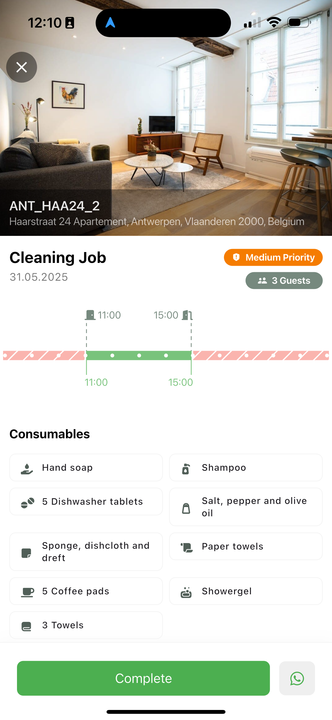

# Managing cleaning tasks

By tapping on any cleaning assignment in the schedule, you open the Task Details View, which provides all the essential information you need to complete the job accurately and on time. This focused view breaks down each cleaning task into clear, actionable components, ensuring that no detail is overlooked.

Each task includes:

* **Property Name and Address** - The unique nickname for the property you’ll be cleaning. This helps avoid any confusion, especially when managing multiple listings, by providing a clear and recognizable reference for the location.
* **Number of Guests and Reservation Details** - Important booking information is displayed, including how many guests are expected and the reservation dates. This helps tailor the cleaning process to the guest’s needs and timing, such as preparing for a family or adjusting for a short stay.
* **Timeline of Check-In and Check-Out** - A visual timeline bar clearly shows the window available for cleaning between guest check-out and check-in times. This helps you manage your time effectively, ensuring the property is ready before the next arrival.
* **Special Services** - Any additional requests or services are listed here—for example, setting up a baby bed, arranging extra linens, or other guest preferences. These details ensure personalized service that enhances the guest experience.
* **Required Consumables** - A checklist of consumable items that need to be replenished during the cleaning, such as toilet paper, soap, shampoo, and cleaning supplies. Keeping track of these helps maintain consistent quality across all properties.
* **Smart Lock Battery Status** - The app displays the current battery level of the property's smart lock, so you can anticipate if the lock may need attention soon. This feature helps avoid access issues and ensures smooth entry for cleaning teams.

<figure><figcaption></figcaption></figure>
