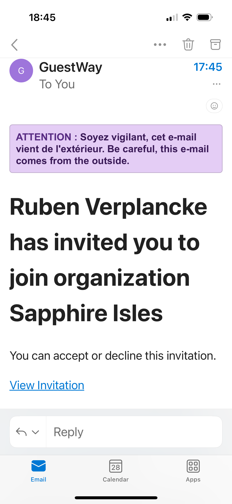

# Getting started

The **Guestway App** is a smart, user-friendly platform designed to simplify and streamline cleaning operations for hospitality teams. Whether you're managing a single vacation rental or coordinating a large team across multiple properties, GuestWay offers powerful tools to stay organized, informed, and connected.

At its core, the app features a dynamic cleaning schedule that clearly outlines daily tasks, assignments, and progress in real time. Each team member knows exactly what to do, where to be, and when—reducing confusion and increasing efficiency.

In addition, the unified inbox allows seamless communication between cleaning staff, management, and even guests. This central hub ensures that everyone stays on the same page, with quick access to messages, updates, and special requests.

This tab guides you through the first steps of setting up your Guestway App account. You’ll learn how to accept your invitation, create your account, and install the app on your device. Whether you're using iOS or Android, this section ensures you're ready to access Guestway and begin managing your experience with ease.

#### **Accepting the Invitation:**

You will receive an email invitation to join the Guestway App. Click on “View Invitation” to access the account setup page. Accept the invitation to begin the registration.

<figure><figcaption></figcaption></figure>

Creating Your Online Account follow the prompts to create your account. Complete the process by agreeing to the Terms and Conditions. You’re now registered!

#### **Installing the App:**

To install the Guestway App, open the App Store or Google Play Store on your device and search for “Guestway.” Tap on the official app, then select “Install”

<figure><figcaption></figcaption></figure>

* iOS:[ Guestway on Apple Store](https://apps.apple.com/be/app/guestway-management/id6444291470)
* Android:[ Guestway on Google Play\
  ](https://play.google.com/store/apps/details?id=io.guestway.management)

Once the app is installed, open it and log in using the credentials provided by your manager or team lead.

<figure><figcaption></figcaption></figure>

#### **You're Now Active!**

You're ready to use the app! If you see a message like “You are not part of any cleaning team,” contact your supervisor to be added to your building. Once you're added, your cleaning schedule and tasks will appear automatically. If the issue persists, you may also reach out to Guestway support for further assistance.

#### Navigation Menu Overview

At the bottom of the screen, you’ll find the main navigation tabs, allowing quick access to essential features:

* **Cleaning Overview** – Displays all scheduled and completed cleanings. This section helps you stay on top of your daily tasks and manage your workload efficiently.
* **Inbox** – Centralizes all communication related to guest reservations, including messages and internal notes. Use this tab to track conversations, respond to inquiries, and stay informed about any updates.
* **Settings** – Allows you to manage app preferences, adjust notification settings, switch between organizations (if you manage multiple), and update your user profile or login details.
