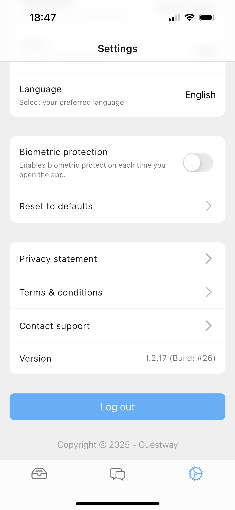

# Settings

The **Settings tab** in the Guestway App allows users to customize their app experience, manage notifications, switch between organizations, and access important system information.

This section ensures each team member can tailor the app to suit their preferences and responsibilities while maintaining control over privacy and communication settings.

<figure><figcaption></figcaption></figure>

#### **Notification Settings**

At the top of the Settings screen in the Guestway App, you'll find the **Notification Settings** section. This area allows you to fine-tune how and when you'd like to receive alerts, helping you stay informed and responsive without being overwhelmed.

* **Notifications are enabled:** When this option is turned on, you’ll receive all relevant notifications based on your role and activity. It ensures that no important update slips through, keeping you fully in the loop.
* **Guest message in any conversation:** Activate this to receive alerts whenever a guest sends a message in any conversation — even if you're not directly assigned to it. This setting is useful for supervisors or team members who want to monitor general guest interactions.
* **Conversation assigned to you:** This option ensures you’re notified immediately when a conversation is assigned to you by a member of the communication team. It’s essential for prompt follow-ups and efficient response handling.
* **Guest message in flagged conversation:** Receive notifications whenever a guest replies within a conversation that has been flagged for special attention. Flagged conversations often indicate a priority issue or a guest who requires ongoing support, so this alert helps you stay on top of critical situations.

These customizable notification options are designed to support communication teams in staying organized, responsive, and aligned — helping reduce the risk of missing important guest messages or assignments.

#### Organization Management

If you belong to multiple organizations, such as different cities or teams, you can easily switch between them in the app. Simply tap the organization field, choose your preferred organization, and press "Done" to apply the change. This ensures your dashboard, tasks, and inbox show only the information relevant to the selected organization, helping you stay focused on what matters most.

#### Display and Accessibility

**Theme:** Customize the app’s appearance by choosing between **Light** or **Dark** mode. Selecting the mode that best suits your visual comfort can reduce eye strain and improve usability during different lighting conditions, whether you’re working in bright daylight or low-light environments.

**Language:** Select your preferred language from the available options to make the app more accessible and user-friendly for multilingual teams. This ensures everyone can navigate and use the platform comfortably, improving communication and reducing misunderstandings.

<figure><figcaption></figcaption></figure>

#### Security and App Behavior

**Biometric Protection:** Activate this feature to require Face ID or fingerprint authentication every time you open the app. This adds an important layer of security, helping to protect sensitive data and ensure that only authorized users can access the platform.

**Reset to Defaults:** If you want to start fresh, use this option to revert all your app preferences—including theme, language, and notification settings—back to the original factory defaults. This can be useful if you encounter issues or simply want to restore the app to its default configuration.

#### Legal and Support

**Privacy Statement:** Review how your personal and organizational data is collected, used, and protected within the Guestway platform.

**Terms & Conditions:** Familiarize yourself with the legal agreement that governs your use of Guestway’s services.

**Contact Support:** Use this option to quickly get in touch with our support team for technical assistance or urgent issues.

**Log Out**

Use the **Log Out** button to safely exit the app. This is recommended when switching devices or handing off your device to someone else.
